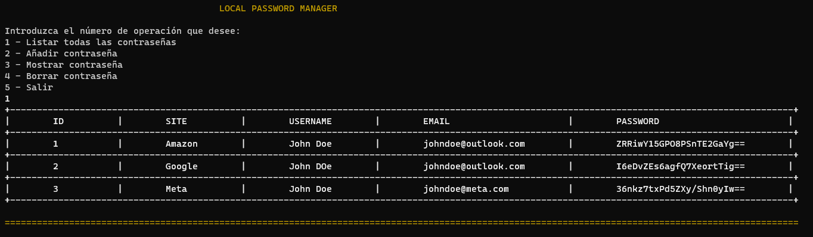
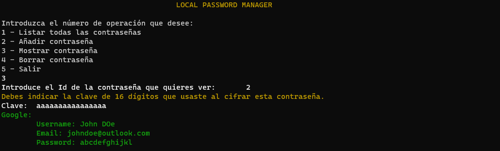

# LocalPasswordManager

Local password manager is a password manager. It performs encryption with the AES algorithm provided by .NET's own library `System.Security.Cryptography`. 
It stores passwords locally along with other data such as site name, username and email.

## How is it used?

The administrator is a console application, it displays a menu with the different options that can be used by the user.

In order to encrypt a password you need to create your own 16-digit key, with this key you will be able to encrypt and decrypt passwords. Be careful, if you lose the key with which you encrypted a password, it will not be possible to decrypt it.
After adding a password, it is possible to check what the password is by decrypting it.

